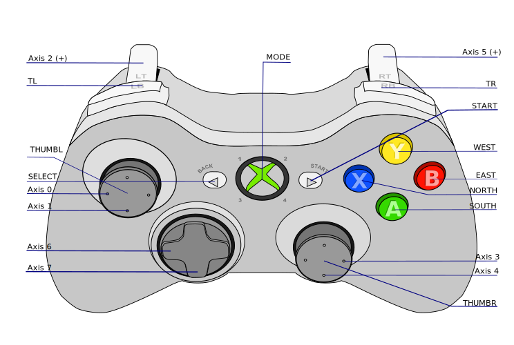

# xpad-profiles

Profiles for Xbox compatible controller with Linux evdev driver "xpad". The repo contains collection for misc games and emulators.

## Installation and Usage

 - Copy `SETTINGS.env.example` to `SETTINGS.env`. 
 - Adjust the settings file matching your joypad
 - run the installation scripts you need

## Installation scripts

Install Script | Description
--- | ---
install-dolphin.sh | Install Wiimote and GCPad profiles for Dolphin emulator
install-mupen64plus.py | Install the config for mupen64plus - N64 emulator


# Base profile
The Linux evdev driver "xpad" used for Xbox compatible controller send the next codes:



Derivative work (added labels) of [Jishenaz / CC0](https://commons.wikimedia.org/wiki/File:Xbox_Controller.svg)

`evtest /dev/input/by-id/usb-*event-joystick`

```
Supported events:
  Event type 0 (EV_SYN)
  Event type 1 (EV_KEY)
    Event code 304 (BTN_SOUTH)
    Event code 305 (BTN_EAST)
    Event code 307 (BTN_NORTH)
    Event code 308 (BTN_WEST)
    Event code 310 (BTN_TL)
    Event code 311 (BTN_TR)
    Event code 314 (BTN_SELECT)
    Event code 315 (BTN_START)
    Event code 316 (BTN_MODE)
    Event code 317 (BTN_THUMBL)
    Event code 318 (BTN_THUMBR)
  Event type 3 (EV_ABS)
    Event code 0 (ABS_X)
      Value      0
      Min   -32768
      Max    32767
      Fuzz      16
      Flat     128
    Event code 1 (ABS_Y)
      Value      0
      Min   -32768
      Max    32767
      Fuzz      16
      Flat     128
    Event code 2 (ABS_Z)
      Value      0
      Min        0
      Max      255
    Event code 3 (ABS_RX)
      Value      0
      Min   -32768
      Max    32767
      Fuzz      16
      Flat     128
    Event code 4 (ABS_RY)
      Value      0
      Min   -32768
      Max    32767
      Fuzz      16
      Flat     128
    Event code 5 (ABS_RZ)
      Value      0
      Min        0
      Max      255
    Event code 16 (ABS_HAT0X)
      Value      0
      Min       -1
      Max        1
    Event code 17 (ABS_HAT0Y)
      Value      0
      Min       -1
      Max        1
```
