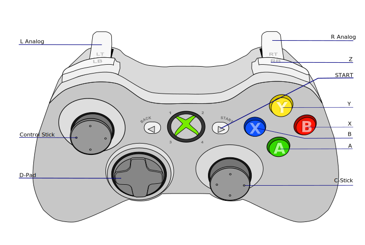
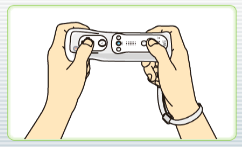
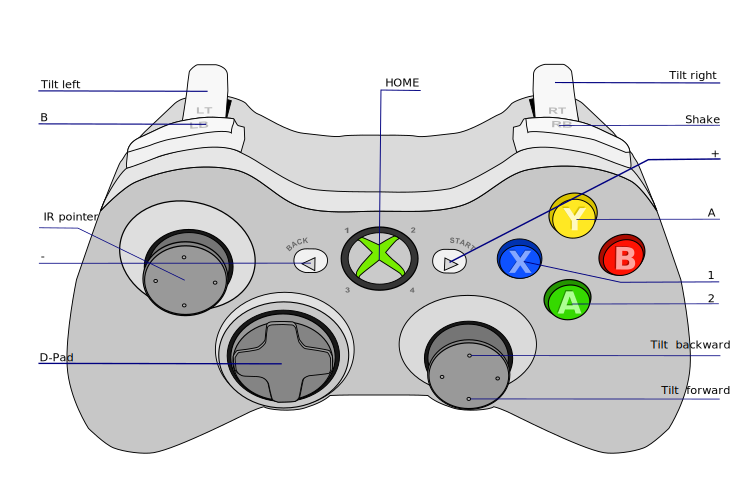

# dolphin-emu-profiles
Input profiles for Dolphin emulator. Applicable for Xbox compatible controller with Linux evdev driver "xpad".

## Installation and Usage
Copy at least the "Wiimote" and "GCPad" folders to ~/.config/dolphin-emu/Profiles or ~/.dolphin-emu/Config/Profiles

After loading the profile you need to select your Xbox compatible joypad because this setting is not in profile file.

## Base profile
The Linux evdev driver "xpad" used for Xbox compatible controller send the next codes to the dolphin emulator:

Derivative work (added labels) of [Jishenaz / CC0](https://commons.wikimedia.org/wiki/File:Xbox_Controller.svg)

## Profile GCPad/XB default.ini
Default profile for [GameCube Controller](https://commons.wikimedia.org/wiki/File:GameCube_controller.png).
Should be applicable for all games.

Show

 

## Profile Wiimote/XB Horizontal.ini

This profile is optimized for WII Remote without attachments in horizontal mode.

Show

